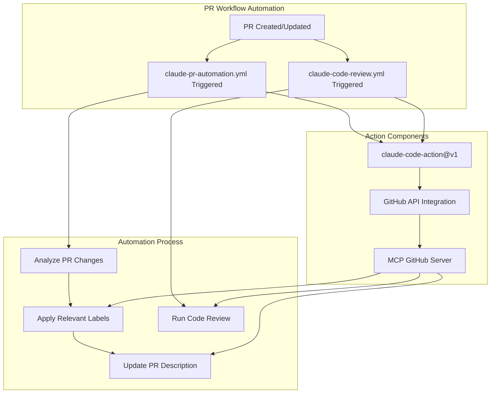

## 📊 Description
- [Clear bullet point of what this PR accomplishes]
- [Additional changes if any]
- [Configuration or setup changes]

## 🔗 Related Issues
[Link to issues or write "None"]

## 🚨 Breaking Changes
[List any breaking changes or write "None"]

___

## 📈 Diagram Walkthrough *(Skip if not applicable)*

*Replace with relevant architecture/flow diagram for your changes*

## 🧪 Review & Testing
**Checklist:**
- [ ] [Quick checklist item to verify]
- [ ] [Another verification point]

**Test steps:**
1. [Specific action to test the changes]
2. [Validate edge cases]

___

<h2>📁 Files Changed</h2>

<table>
<thead><tr><th>Category</th><th>Files</th></tr></thead>
<tbody>
<tr><td><strong>[Category name]</strong></td>
<td>

<strong>[filename]</strong> - [brief description]

[File path]

<ul>
<li>[What was changed]</li>
<li>[Why it was changed]</li>
<li>[Impact of the change]</li>
</ul>

</td></tr>
</tbody>
</table>

